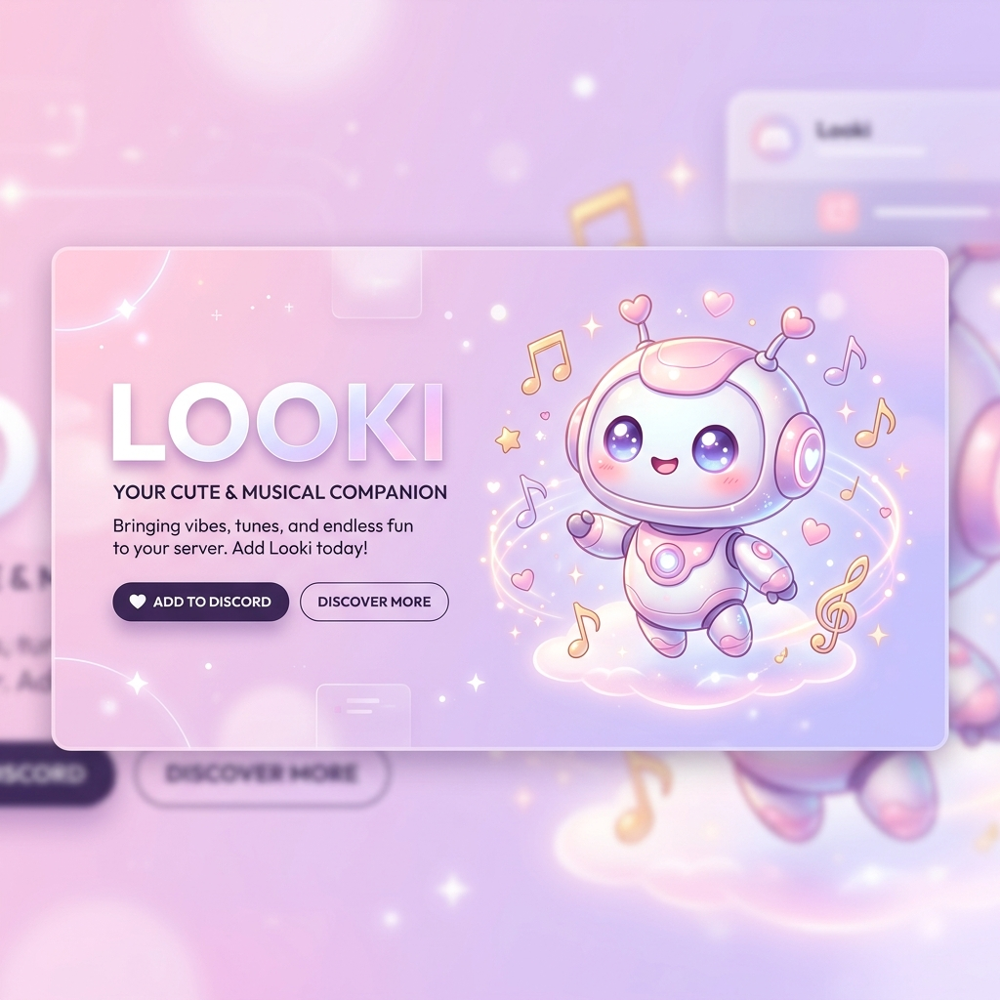
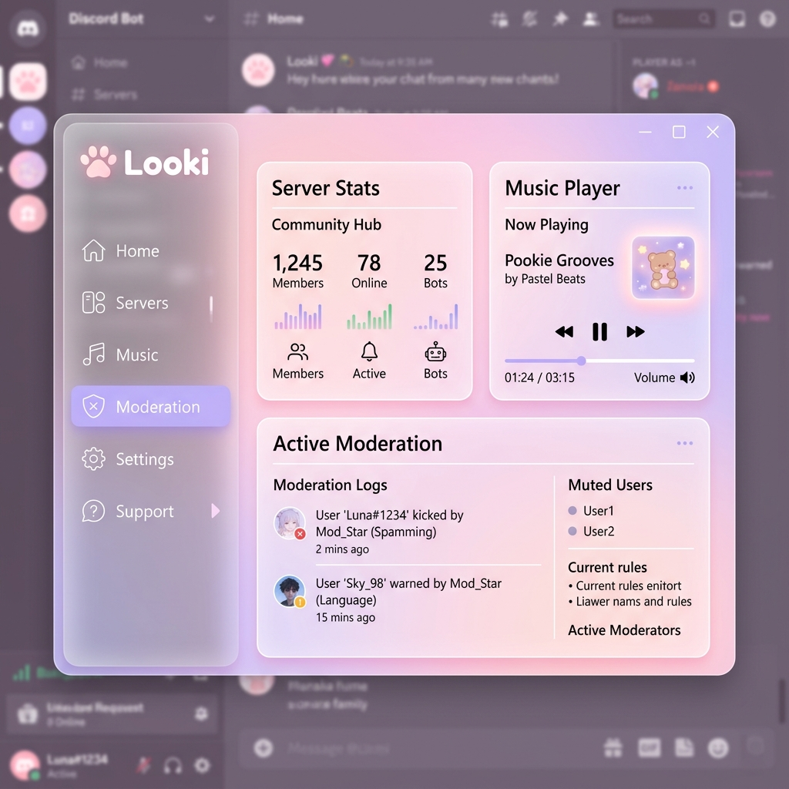

<div align="center">
  
  
  # 🌸 LOOKI
  **A soft, hyper-aesthetic Discord bot & high-craft dashboard.**
  
  [](https://github.com/looki/looki-bot)
  [](https://discord.gg/yourserver)
  [](https://looki.io)
  [](LICENSE)

  ---
  
  *Looki is more than just a bot. It's a vibe. Designed for communities that value aesthetics, performance, and simplicity. Powered by Shoukaku and Lavalink for flawless audio.* ✨
</div>

## 🎀 OVERVIEW

**Looki** combines a robust Discord bot backend with a modern, high-craft **Next.js Dashboard**. It offers high-fidelity music streaming, comprehensive moderation tools, and an interface that feels like "pookie-core" but performs like industry-grade software.

---

### 💻 DASHBOARD PREVIEW

<div align="center">
  
  <p><i>The LOOKI dashboard: Clean, fast, and remarkably beautiful.</i></p>
</div>

---

## 🎵 FEATURES

### 🎧 High-Fidelity Music
- **Lavalink Powered**: Multi-node failover system using **Shoukaku v4**.
- **Crystal Clear Audio**: Zero-lag streaming with support for YouTube, SoundCloud, and more.
- **Advanced Controls**: Queue management, volume normalization, skip, and pause.
- **Dynamic Playback**: Real-time track status updates in your Discord server.

### 🛡️ Smart Moderation
- **MEE6 Parity**: All your favorite moderation commands rewritten for a "Looki" aesthetic.
- **Safety First**: Easy-to-use timeout, ban, kick, and clear commands.
- **Server Guard**: Intelligent logging and interaction-based response system.

### 💖 Aesthetic Experience
- **Hyper-Aesthetic Embeds**: Every response is carefully themed with pastel colors and sparkles.
- **Interactive UI**: High-craft buttons, menus, and modals.
- **Next.js Dashboard**: A premium, glassmorphic dashboard for server owners to configure everything from the web.

---

## 🛠️ INSTALLATION

### 1. Prerequisites
- [Node.js v20+](https://nodejs.org/)
- [Supabase](https://supabase.com/) Account (for database)
- [Discord Developer Portal](https://discord.com/developers/applications) Access
- [Lavalink Node](https://github.com/lavalink-devs/Lavalink) (or use public nodes included)

### 2. Discord Bot Setup
```bash
# Clone the repository
git clone https://github.com/yourusername/looki-bot.git
cd looki-bot

# Install dependencies
npm install

# Setup environment variables
cp .env.local .env
```

Define the following in your `.env`:
```env
DISCORD_TOKEN=your_bot_token
CLIENT_ID=your_bot_client_id
SUPABASE_URL=your_supabase_url
SUPABASE_KEY=your_supabase_anon_key
```

### 3. Dashboard Setup
```bash
cd dashboard

# Install frontend dependencies
npm install

# Run development server
npm run dev
```

---

## 📁 PROJECT STRUCTURE

```bash
.
├── commands/           # 🌸 Discord slash & prefix commands
├── dashboard/          # 💻 Next.js high-craft dashboard
│   ├── app/            #   └── App router & layouts
│   ├── components/     #   └── UI components (Shadcn/UI)
│   └── lib/            #   └── Shared utilities
├── events/             # 🔔 Discord event handlers
├── models/             # 🗄️ Database schemas (Supabase)
├── utils/              # 🛠️ Common logic & audio managers
└── index.js            # 🚀 Bot entry point
```

---

## 📋 ENVIRONMENT VARIABLES

| Variable | Description |
| :--- | :--- |
| `DISCORD_TOKEN` | Your Discord bot's secret token. |
| `CLIENT_ID` | Your Discord Application ID. |
| `SUPABASE_URL` | Your Supabase project URL. |
| `SUPABASE_ANON_KEY` | Your Supabase project's anon/public key. |
| `NEXTAUTH_SECRET` | Secret key for dashboard authentication. |
| `PORT` | Listening port (Bot: 8080 by default). |

---

## 🚀 DEPLOYMENT

### Deploying the Bot
The bot is optimized for platforms like **Koyeb** or **Railway**.
1. Set the build command to `npm install`.
2. Set the start command to `node index.js`.
3. Ensure the `PORT` variable is set to handle the heartbeat server.

### Deploying the Dashboard
Optimized for **Vercel** or **Netlify**.
```bash
npm run build
```

---

## 🎨 DESIGN SYSTEM

Looki follows a unique **"Hyper-Aesthetic / Pookie-Core"** design philosophy:
- **Primary Color**: `#FFB6C1` (Light Pink)
- **Secondary Color**: `#E6E6FA` (Lavender)
- **Glassmorphism**: High transparency levels with backdrop-blur.
- **Iconography**: Delicate, minimalist icons (using Iconsax).

---

## 🤝 CONTRIBUTING

We love contributions! Whether it's a new command or a theme refinement:
1. Fork the repo.
2. Create your feature branch (`git checkout -b feature/AmazingFeature`).
3. Commit your changes (`git commit -m 'Add some AmazingFeature'`).
4. Push to the branch (`git push origin feature/AmazingFeature`).
5. Open a Pull Request.

---

## 📄 LICENSE

Distributed under the **MIT License**. See `LICENSE` for more information.

<div align="center">
  <br>
  Built with 💖 by the Looki Team.
</div>
