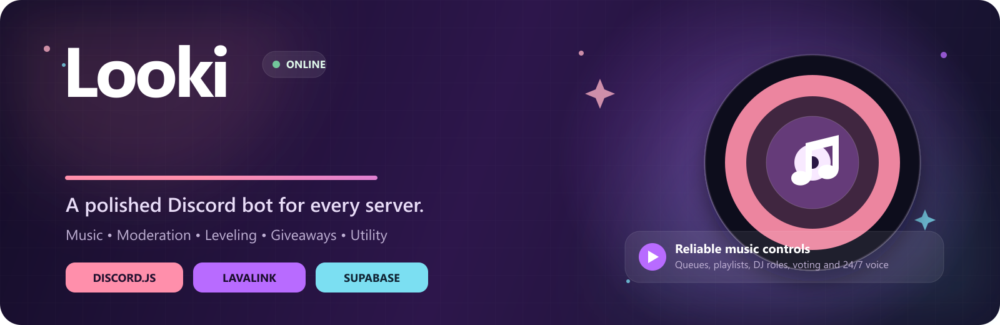
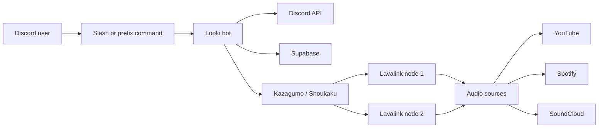

<div align="center">



# Looki

**A polished Discord bot for music, moderation, leveling, giveaways, utilities, and fun.**

[](https://nodejs.org/)
[](https://discord.js.org/)
[](https://supabase.com/)
[](https://github.com/lavalink-devs/Lavalink)

[Features](#features) · [Setup](#quick-start) · [Database](#supabase-and-sql) · [Commands](#command-system) · [Embeds](#embed-system)

</div>

---

## About Looki

Looki is a multi-purpose Discord bot built with Discord.js. It combines reliable Lavalink music playback with practical moderation, persistent Supabase storage, server leveling, giveaways, reaction GIFs, and clean category-based embeds.

The bot currently registers **60 unique slash commands** and includes an administrator-only `/sync` command for rebuilding Discord command registrations.

## Features

| System | Highlights |
| --- | --- |
| Music | YouTube, Spotify and SoundCloud search, queues, playlists, favorites, skip voting, DJ controls, looping, seeking and volume |
| Voice | Persistent 24/7 mode, restart restoration, idle disconnect and multi-node Lavalink failover |
| Moderation | Ban, temporary ban, kick, timeout, warnings, message clearing, channel locks and slowmode |
| Community | XP, levels, leaderboards, giveaways, polls and safe reaction GIF commands |
| Configuration | Per-server prefix, moderation logs, welcome messages, music channel, DJ role and playback defaults |
| Persistence | Supabase-backed settings, cases, XP, giveaways, favorites, playlists and listening statistics |
| Reliability | Permission-aware responses, interaction deferring, command validation and graceful provider failures |

## Music Experience

Looki's player is powered by **Kazagumo**, **Shoukaku**, and **Lavalink**.

- Multiple Lavalink nodes with automatic player migration
- Saved server playlists with duplicate protection
- Personal favorites and listening statistics
- Requester, DJ-role, and moderator control permissions
- Vote skipping for regular listeners
- Paginated queues and queue management
- Configurable default volume, loop mode, and announcement channel
- 24/7 voice mode restored after bot restarts
- Automatic disconnect when an unused voice channel stays empty
- Friendly offline messages when no audio node is available

### Music Commands

```text
/play           Search for a song or play a supported URL
/queue          View the current queue with pagination
/nowplaying     View playback progress and track details
/pause          Pause playback
/resume         Resume playback
/skip           Skip directly or begin a vote skip
/stop           Clear the session and leave voice
/volume         Change and save the server volume
/seek           Jump to a position in the current track
/loop           Loop the current track or entire queue
/shuffle        Shuffle upcoming tracks
/remove         Remove an upcoming queue entry
/clearqueue     Clear upcoming tracks without stopping
/favorites      Add, list, remove, or clear favorites
/playlist       Create, save, load, and manage playlists
/musicstats     View listening statistics
/musicsettings  Configure server-wide music behavior
/247            Manage persistent voice mode
```

## Embed System

Looki uses shared embed builders so responses remain consistent across every command category.

| Category | Color | Typical use |
| --- | --- | --- |
| Music | `#B86BFF` | Tracks, queues and playback controls |
| Moderation | `#F4A261` | Cases, warnings and server actions |
| Success | `#72C69B` | Completed settings and command actions |
| Error | `#ED6A8A` | Validation, permission and service errors |
| Fun | `#FF8FAB` | Reactions, games and giveaways |
| Utility | `#8ECAE6` | Server, member and bot information |

### Example Music Embed

> **Looki Music | Your listening session**
>
> ## Now Playing
>
> **Track:** Majboor
>
> `------O-------` `1:42 / 3:28`
>
> **Artist:** Sheheryar Rehan
>
> **Requested by:** ahhhufff
>
> **Up next:** 4 tracks
>
> `Shuffle` `Previous` `Pause/Resume` `Skip` `Loop`
>
> `Clear` `Vol -` `Stop` `Vol +` `Favorite`

Create a category embed anywhere in the bot:

```js
const { createEmbed } = require('./utils/embedBuilder');

const embed = createEmbed('success', client)
  .setTitle('Settings Updated')
  .setDescription('The music announcement channel has been saved.')
  .addFields({
    name: 'Channel',
    value: `${interaction.channel}`,
    inline: true,
  });
```

Music commands use the specialized helper:

```js
const { createMusicEmbed } = require('./utils/musicEmbed');

const embed = createMusicEmbed(client, {
  title: 'Added to queue',
  description: `**[${track.title}](${track.uri})**`,
  thumbnail: track.thumbnail,
  footer: `Requested by ${interaction.user.username}`,
});
```

## Architecture



```text
commands/               Slash and prefix command implementations
  config/               Server configuration
  fun/                  Games, giveaways and reaction GIFs
  leveling/             XP and leaderboard commands
  moderation/           Moderation actions and cases
  music/                Playback, playlists and voice settings
  utility/              Information, help and command sync
events/                 Discord and music event handlers
models/                 Supabase data-access models
utils/                  Embeds, audio, registry and shared helpers
assets/readme/          GitHub README artwork
dashboard/              Separate Next.js dashboard
index.js                Bot startup and Lavalink configuration
deploy.js               Global slash-command deployment
supabase_schema.sql     Complete database schema
```

## Requirements

- [Node.js 20 or newer](https://nodejs.org/)
- A Discord application and bot token
- A Supabase project
- One or more Lavalink v4 nodes
- Spotify credentials for Spotify URL support

## Quick Start

### 1. Clone and install

```bash
git clone https://github.com/Looka708/Looki---.git
cd Looki---
npm install
```

### 2. Configure environment variables

Copy `.env.example` to `.env` and fill in your private credentials.

```env
# Discord
DISCORD_TOKEN=your_discord_bot_token
BOT_ID=your_discord_application_id

# Supabase
SUPABASE_URL=https://your-project.supabase.co
SUPABASE_SERVICE_ROLE_KEY=your_service_role_key

# Spotify
SPOTIFY_CLIENT_ID=your_spotify_client_id
SPOTIFY_CLIENT_SECRET=your_spotify_client_secret

# Primary Lavalink node
LAVALINK_URL=localhost:2333
LAVALINK_PWD=youshallnotpass
LAVALINK_SECURE=false

# Optional node selection
LAVALINK_NODE_NAMES=Primary

# Runtime
PORT=8080
SELF_URL=
```

Never commit `.env`, Discord tokens, Supabase keys, Lavalink passwords, Spotify secrets, or cookies.

### 3. Create the database

Open the **Supabase SQL Editor**, paste the contents of [`supabase_schema.sql`](supabase_schema.sql), and run it once.

### 4. Publish commands

```bash
npm run deploy
```

Deployment clears old global and guild registrations before publishing the current command set globally. Discord can take some time to display refreshed global commands.

Administrators can also run:

```text
/sync
```

### 5. Start Looki

```bash
npm start
```

For local development with automatic restarts:

```bash
npm run dev
```

## Supabase and SQL

Looki uses Supabase PostgreSQL for persistent bot state.

### Main Tables

| Table | Stores |
| --- | --- |
| `warnings` | Moderation cases, reasons, duration and expiration state |
| `xp` | Per-server user XP and level |
| `server_config` | Prefix, modlog, automod, welcome and leveling settings |
| `giveaways` | Giveaway messages, participants, winners and end time |
| `user_favorites` | Unique saved songs for each user |
| `user_music_stats` | Listening time, play count and favorite count |
| `server_music_settings` | Volume, DJ role, channels, loop mode and 24/7 state |
| `server_playlists` | User-created server playlists stored as JSONB |
| `music_activity_log` | Playback and error activity |

### How the SQL Works

The schema creates tables with uniqueness constraints so duplicate records are prevented at the database layer.

```sql
CREATE TABLE IF NOT EXISTS xp (
  id BIGSERIAL PRIMARY KEY,
  guild_id TEXT NOT NULL,
  user_id TEXT NOT NULL,
  xp INTEGER DEFAULT 0,
  level INTEGER DEFAULT 0,
  updated_at TIMESTAMP WITH TIME ZONE DEFAULT NOW(),
  UNIQUE (guild_id, user_id)
);
```

`UNIQUE (guild_id, user_id)` means a user receives one XP row per server. The model can safely update that row instead of creating duplicates.

Music settings follow the same pattern:

```sql
CREATE TABLE IF NOT EXISTS server_music_settings (
  id BIGSERIAL PRIMARY KEY,
  guild_id TEXT NOT NULL UNIQUE,
  default_volume INTEGER DEFAULT 50,
  dj_role_id TEXT,
  music_channel_id TEXT,
  music_text_channel_id TEXT,
  stay_247 BOOLEAN DEFAULT FALSE,
  announce_songs BOOLEAN DEFAULT TRUE,
  loop_default_mode INTEGER DEFAULT 0
);
```

Because `guild_id` is unique, an upsert can create or update the complete server configuration:

```sql
INSERT INTO server_music_settings (
  guild_id,
  default_volume,
  stay_247
)
VALUES (
  'YOUR_GUILD_ID',
  50,
  FALSE
)
ON CONFLICT (guild_id)
DO UPDATE SET
  default_volume = EXCLUDED.default_volume,
  stay_247 = EXCLUDED.stay_247;
```

### Useful Queries

View the highest-XP members in a server:

```sql
SELECT user_id, xp, level
FROM xp
WHERE guild_id = 'YOUR_GUILD_ID'
ORDER BY xp DESC
LIMIT 10;
```

View recent moderation cases:

```sql
SELECT case_id, user_id, moderator_id, type, reason, created_at
FROM warnings
WHERE guild_id = 'YOUR_GUILD_ID'
ORDER BY created_at DESC
LIMIT 25;
```

Check all servers using 24/7 voice mode:

```sql
SELECT guild_id, music_channel_id, music_text_channel_id
FROM server_music_settings
WHERE stay_247 = TRUE;
```

Inspect recent music failures:

```sql
SELECT guild_id, song_name, error_message, timestamp
FROM music_activity_log
WHERE action = 'error'
ORDER BY timestamp DESC
LIMIT 50;
```

### Row Level Security

The schema enables PostgreSQL Row Level Security on bot tables. The bot should use the Supabase service-role key on the server only. Never expose that key in Discord responses, client-side dashboard code, logs, screenshots, or source control.

## Lavalink Configuration

Looki supports these environment prefixes:

```text
LAVALINK_URL / LAVALINK_PWD
LAVALINK_LEXIS_URL / LAVALINK_LEXIS_PWD
LAVALINK_JIRAYU_URL / LAVALINK_JIRAYU_PWD
LAVALINK_SERENETIA_URL / LAVALINK_SERENETIA_PWD
LAVALINK_G3V_URL / LAVALINK_G3V_PWD
```

Every configured node is loaded by default. Restrict the pool with:

```env
LAVALINK_NODE_NAMES=Primary,Jirayu,Serenetia
```

For production, a private Lavalink node should be the primary provider. Public nodes may reset connections, become rate limited, change passwords, or disappear without notice.

## Command System

Commands are discovered from the `commands/` folders and serialized from their real `SlashCommandBuilder` definitions.

| Category | Examples |
| --- | --- |
| Configuration | `/settings`, `/setlog` |
| Music | `/play`, `/queue`, `/playlist`, `/musicsettings`, `/247` |
| Moderation | `/ban`, `/kick`, `/warn`, `/timeout`, `/tempban` |
| Leveling | `/rank`, `/leaderboard`, `/givexp`, `/removexp` |
| Fun | `/hug`, `/kiss`, `/poll`, `/giveaway`, `/8ball` |
| Utility | `/help`, `/userinfo`, `/serverinfo`, `/stats`, `/sync` |

The command registry validates:

- Duplicate command names
- Discord description limits
- Slash-command serialization
- Fresh module loading during command sync

## Reaction GIFs

Reaction commands use a centralized provider layer:

1. Request a GIF from `nekos.best`
2. Validate the returned HTTPS image URL
3. Fall back to `waifu.pics` if the primary provider fails
4. Cache successful URLs briefly
5. Send a clean text embed if both providers are unavailable

Supported reactions include blush, cry, dance, high-five, hug, kiss, pat, slap, and wink.

## Scripts

| Command | Purpose |
| --- | --- |
| `npm start` | Start the production bot |
| `npm run dev` | Start with Nodemon |
| `npm run deploy` | Clear existing registrations and publish all commands |
| `npm run clear-commands` | Remove global and guild command registrations |

## Troubleshooting

### `No Lavalink nodes are online`

- Confirm the node hostname resolves.
- Confirm the port is reachable.
- Check the Lavalink password.
- Match `LAVALINK_*_SECURE=true` with TLS/port `443`.
- Restart the bot and wait for a `Node "name" connected` log.

### Discord error `10062: Unknown interaction`

Commands performing network or database work must defer quickly with `interaction.deferReply()` and finish with `interaction.editReply()`.

### Discord error `50013: Missing Permissions`

For music announcements, grant Looki:

- View Channel
- Send Messages
- Embed Links

For voice playback, grant:

- View Channel
- Connect
- Speak

### Duplicate slash commands

Run `/sync` as an administrator or execute:

```bash
npm run deploy
```

Both flows clear old global and guild registrations before republishing the current command set.

## Security

- Keep `.env` and `.env.local` private.
- Rotate credentials immediately if they are committed or posted publicly.
- Use the Supabase service-role key only in the bot process.
- Give the Discord bot only the permissions it needs.
- Prefer private Lavalink infrastructure for production.
- Review generated SQL before running it in a production project.

## Contributing

1. Fork the repository.
2. Create a focused feature branch.
3. Follow the existing command, embed, and model patterns.
4. Validate every command with `toJSON()`.
5. Test permission failures and missing-data states.
6. Open a pull request with a concise behavior summary.

## License

No license file is currently included. All rights are reserved by the repository owner unless a license is added.

---

<div align="center">

Built with Discord.js, Lavalink, Kazagumo, Shoukaku, and Supabase.

**Looki | Helpful, cute, and clear**

</div>
